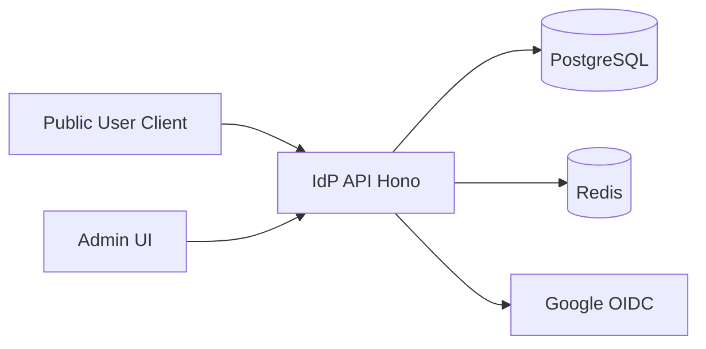

# Threat Model（IdP）

最終更新: 2026-04-26

## 1. システム概要
`apps/idp-server` は Public/Auth/Admin API を提供し、PostgreSQL と Redis を利用して認証・認可・セッションを管理する。

主な対象フロー:
- Signup/Login（email+password, Google）
- Token lifecycle（access/refresh/revocation/introspection）
- MFA（TOTP, recovery code, WebAuthn）
- RBAC/Entitlement authorization
- Admin config update

## 2. 資産一覧
| Asset | 機密性 | 完全性 | 可用性 | 備考 |
|---|---|---|---|---|
| Password hash | High | High | Medium | `users.password_hash` |
| Access/Refresh token hash | High | High | High | `user_sessions` |
| MFA secret / recovery code hash | High | High | Medium | `mfa_factors`, `mfa_recovery_codes` |
| External identity mapping | High | High | Medium | Google連携 |
| RBAC / entitlements | Medium | High | High | 認可判定に直結 |
| System configs | Medium | High | High | Admin API経由更新 |
| security_events / audit_logs | Medium | High | Medium | 監査証跡 |

## 3. 信頼境界

境界:
- Internet ↔ API
- API process ↔ Database
- API process ↔ External IdP
- Admin UI ↔ Admin API

## 4. 前提
- TLS終端はインフラ側で有効化される。
- `JWT_PRIVATE_KEY` と OAuth client secret は安全に管理される。
- DB/Redis は認証付きで閉域アクセスされる。

## 5. 脅威一覧（STRIDE）
| ID | STRIDE | Threat | Affected Flow | 主要影響 |
|---|---|---|---|---|
| TM-001 | Spoofing | Credential stuffing / brute force | `/v1/login` | 不正ログイン |
| TM-002 | Spoofing | OAuth client impersonation | `/oauth/token`, `/oauth/introspection`, `/oauth/revocation` | token不正操作 |
| TM-003 | Tampering | Admin config unauthorized change | `/v1/admin/configs*` | セキュリティ設定改ざん |
| TM-004 | Tampering | External identity mislink | `/v1/login/google`, `/v1/identities/google/link` | アカウント乗っ取り |
| TM-005 | Repudiation | 重要操作の追跡不能 | 全管理系操作 | 監査不成立 |
| TM-006 | Information Disclosure | Account enumeration | login/reset/verify | ユーザー存在漏えい |
| TM-007 | Information Disclosure | Token/secret leakage in logs | 全API | 資格情報漏えい |
| TM-008 | Denial of Service | Rate limit回避によるAPI枯渇 | login/signup/MFA | 認証基盤停止 |
| TM-009 | Elevation of Privilege | RBAC/entitlement stale grant | `/v1/authorization/check`, `/v1/entitlements/check` | 権限昇格 |
| TM-010 | Elevation of Privilege | MFA bypass | `/v1/login`, `/v1/login/google` | 二要素突破 |
| TM-011 | Replay | Refresh token replay/reuse | `/v1/token/refresh`, `/oauth/token` | セッション乗っ取り |
| TM-012 | Replay | WebAuthn challenge replay | `/v1/mfa/webauthn/*` | 不正認証 |

## 6. 脅威ごとの統制（抜粋）
| Threat ID | Prevent | Detect | Respond | Residual Risk |
|---|---|---|---|---|
| TM-001 | login/signup rate limit、MFA | login失敗急増監視 | 該当IP帯の制限、セッション失効 | 分散攻撃の低速持続 |
| TM-002 | Basic client auth必須 | OAuth auth失敗率監視 | client secret rotation | 秘密漏えい時の短時間悪用 |
| TM-003 | admin permission check、CSRF対策 | admin config更新イベント | 緊急ロールバック | 正当権限者の悪用 |
| TM-004 | Google ID token検証、providerEnabled判定 | identity linkイベント監視 | link解除、全セッション失効 | 外部IdP侵害時リスク |
| TM-010 | MFA強制、recovery code rate limit | MFA検証失敗監視 | 強制再認証、recovery再生成 | ソーシャル専用口での依存 |
| TM-011 | refresh rotation + reuse検知 | reuseイベント監視 | 対象ユーザー全セッション失効 | 検知後の短時間悪用 |

## 7. 実装現況のイベントカバレッジ
現行実装で確認できる主な `security_events.event_type`:
- `mfa.recovery_codes.generated`
- `mfa.recovery_codes.revoked`
- `mfa.recovery_code.used`
- `mfa.recovery_codes.low`
- `account.deletion.requested`

ギャップ（要追加）:
- `login.failure` の理由コード統一（運用分析しやすい形式）
- `admin.config.updated` の変更前後差分（diff）保持
- `login.success` / `login.failed` の通知閾値最適化

## 8. 優先度付き対策バックログ
1. `admin.config.updated` に差分payload（before/after）を追加（P1）
2. login/reuseイベントのアラート閾値を本番トラフィックでチューニング（P1）
3. 監視ルールとrunbookのID紐付け自動検証（P2）
4. `security_events` のインデックス設計最適化（P2）

## 9. レビュー履歴
- 2026-04-26: 初版作成
